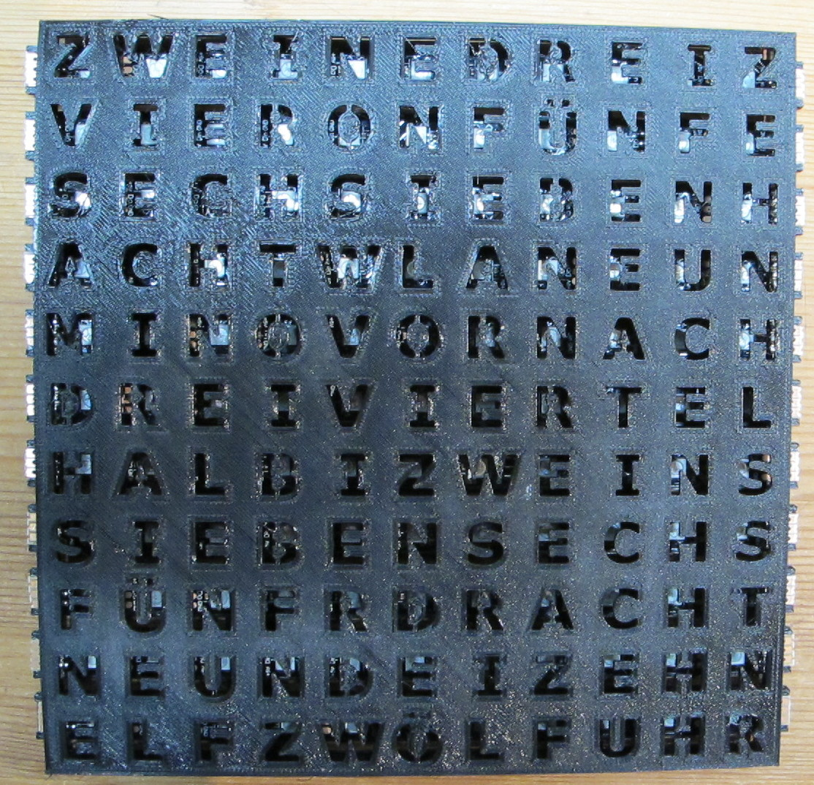

# Wortuhr
Wortuhr basierend auf ESP-12F inkl. Firmware, PCB und Hardware-Beschreibung.

Ich übernehme keinerlei Verantwortung für die Funktionsfähigkeit und Sicherheit dieses Projekts. Jeder, der es nachbaut, ist selbst dafür verantwortlich!

Die Idee und insbesondere die Anordnung der Buchstaben habe ich mir im FabLab Nürnberg abgeschaut. Vielen Dank an der Stelle an den Unbekannten! :)

Die Hardware besteht aus 11 LED-Streifen à 11 LEDs vom Typ WS2812, die RGB fähig sind. Als Controller dient ein ESP-12F (ESP8266), der sich die Uhrzeit über das Internet per NTP holt. Die Konfiguration wird über ein Webinterface vorgenommen. Ein Helligkeitssensor wird verwendet, um die Helligkeit der Uhr (falls gewünscht) automatisch anzupassen. Es gibt auch eine Möglichkeit die Uhr zu einer bestimmten Zeit dunkel zu schalten, und zu einer anderen Zeit wieder zu aktivieren. Außerdem kann man die Farbe der LEDs pro Wort einstellen.

## Weitere Infos und die Bauanleitung sind im [Wiki](https://github.com/SteMaker/wortuhr/wiki)

## Aufbau
Als LED-Streifen werden WS2812 verwendet. Für jede der 11 Zeilen wird ein Streifen mit 11 LEDs verwendet. Die Spannungsversorgung habe ich für jeden Streifen einzeln auf die Hauptplatine gezogen, die Datenleitung muss von `Dout` des einen Streifens zum `Din` des Streifens der nächsten Zeile gezogen werden. Der `Din` der ersten Zeile muss rechts oben liegen und wird mit dem Controller verbunden. Von der linken Seite der ersten Zeile geht dann der `Dout` zum `Din` der linken Seite des zweiten Streifens, usw. Das ist wichtig, da sonst die falschen Buchstaben aufleuchten. Ich verwende LED Streifen mit 60 LEDs pro Meter.

Die Buchstabenmatrix habe ich mit einem 3D-Drucker ausgedruckt. Die STL-Dateien sowie die SVG-Basis liegen im Ordner `rahmen`. Es gibt eine Rückseite, in die die 11 LED-Streifen geklebt werden und eine Vorderseite mit den Aussparungen für die Buchstaben. Das Ganze kommt dann in einen Bilderrahmen. Der IKEA RIBBA 23x23 passt perfekt.

Alternativ kann die Frontplatte aus lackiertem Acrylglas gelasert werden.

