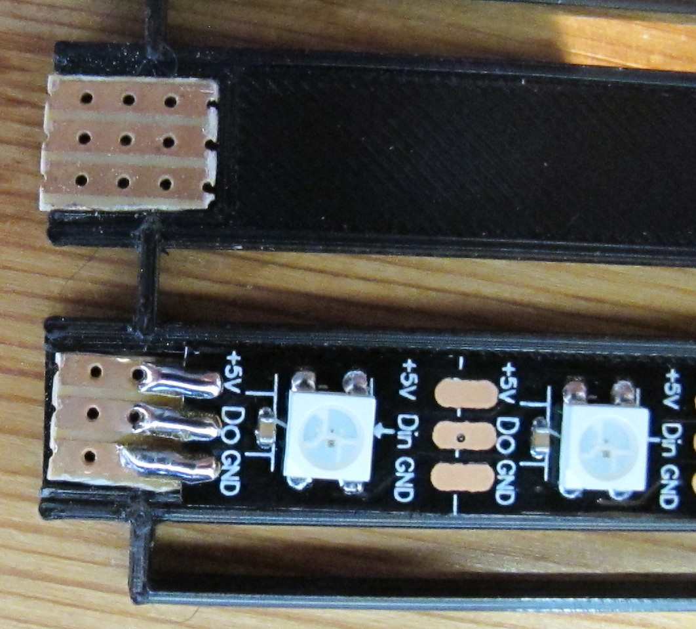
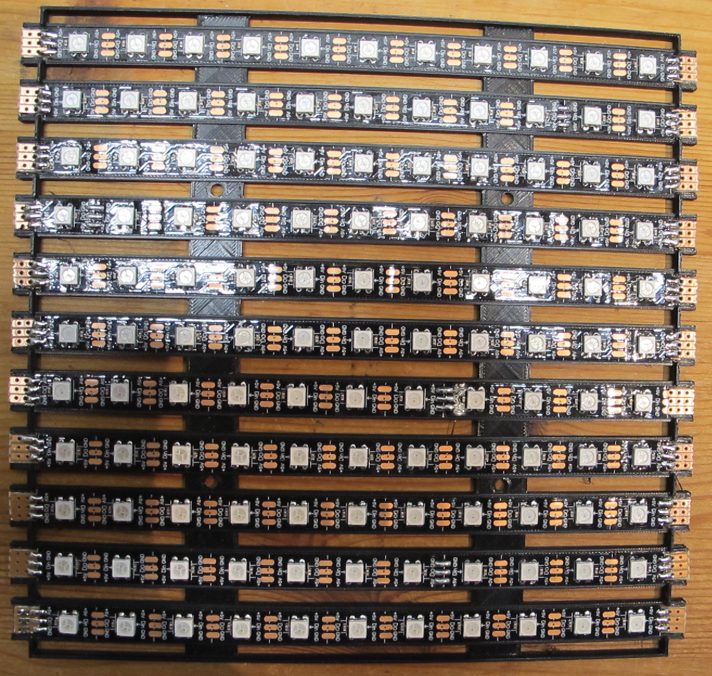
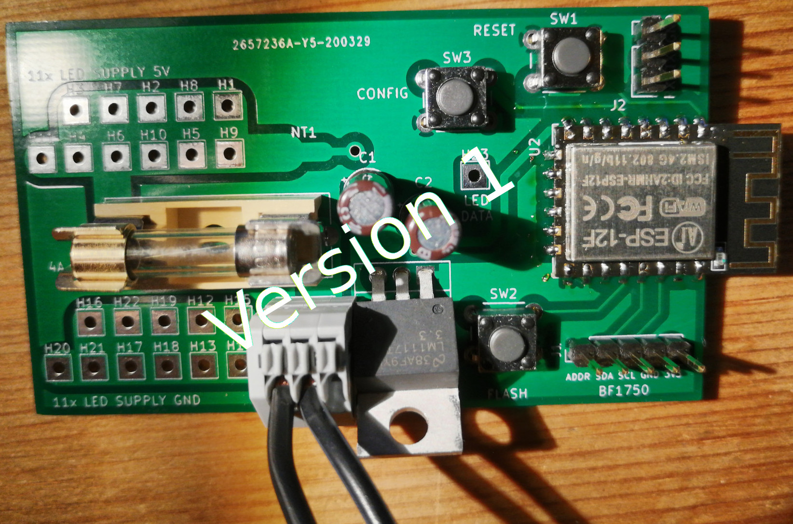

# Wortuhr
Wortuhr basierend auf ESP-12F incl. Firmware, PCB und Hardware-Beschreibung.

Bitte beachten: Ich arbeite noch an dem Projekt, es sind nicht alle Funktionen implementiert. Version 1 des PCB ist funktionsfähig, hat aber einige Probleme (siehe unten). PCB Version 2 muss noch getestet werden. In der Firmware fehlt im wesentlichen noch die Unterstützung für den Helligkeitssensor, das befindet sich in Entwicklung - siehe branch bf1750.

Ich übernomme keinerlei Verantwortung für die Funktionsfähigkeit und Sicherheit dieses Projekts. Jeder der es nachbaut ist selbst dafür verantwortlich!!!!

Die Idee und insbesondere die Anordnung der Buchstaben habe ich mir im FabLab Nürnberg abgeschaut. Vielen Dank an der Stelle an den Unbekannten :)

Die Hardware besteht aus 11 LED-Streifen á 11 LEDs, die RGB fähig sind. Als controller dient ein ESP-12F (ESP8266), der sich die Uhrzeit über das Internet per NTP holt. Die Konfiguration wird über ein webinterface vorgenommen. Ein Helligkeitssensor wird verwendet, um die Helligkeit der Uhr (falls gewünscht) automatisch anzupassen. Es gibt auch eine Möglichkeit die Uhr zu einer bestimmten Zeit dunkel zu schalten, und zu einer anderen Zeit wieder zu aktivieren. Ausserdem kann man die Farbe der LEDs einstellen.

## Aufbau
Als LED Streifen werden WS2812 verwendet. Für jede der 11 Zeilen wird ein Streifen mit 11 LEDs verwendet. Die Spannungsversorgung habe ich für jeden Streifen einzeln auf die Hauptplatine gezogen, die Datenleitung muss von Dout des einen Streifens zum Din des Streifens der nächsten Zeile gezogen werden. Der Din der ersten Zeile muss rechts oben liegen und wird mit dem controller verbunden. Von der linken Seite der ersten Zeile geht dann der Dout zum Din der linken Seite des zweiten Streifens, usw. Das ist wichtig, da sonst die falschen Buchstaben aufleuchten. Ich verwende LED Streifen mit 60 LEDs pro Meter.

Die Buchstabenmatrix habe ich mit einem 3D-Drucker ausgedruckt, die STL Dateien, als auch die SVG Basis liegen im Ordner rahmen. Es gibt eine Rückseite, in die die 11 LED-Streifen geklebt werden und eine Vorderseite mit den Aussparungen für die Buchstaben. Das Ganze kommt dann in einen Bilderrahmen. Beim Aufkleben der LED Streifen muss man beachten, dass Din der ungeraden Zeilen rechts liegt, Din der geraden Zeilen links. Falls man hier einen Fehler macht, kann man das in der FW anpassen, es muss aber zwingend immer Dout des oberen Streifens mit Din des nächsten Streifens verbunden werden.. Die ausgedruckte Vorderseite kommt einfach oben drauf und wird verschraubt. Das Ganze dann in einen Bilderrahmen (ich plane zur Zeit Ikea Ribba 23x23). Da ich in der ersten Version Probleme mit abreissenden pads hatte, habe ich in der zweite Version Aussparungen für Streifenrasterplatinen gelassen, an denen Streifen und Kabel angelötet werden. Ich gehe davon aus, dass ein direktes Verlöten trotzdem noch geht. Zwischen die Scheibe des Rahmens und die Buchstabenmatrix kommt Brotpapier (oder ähnliches), um das Licht schöner zu verteilen.

Für den ESP-12F und ein wenig Beschaltung gibt es ein KiCad Projekt im Ordner PCB. Die zweite Version habe ich noch nicht probiert, sie sollte neben den 3D-Druck-Rahmen mit in dem Bilderrahmen daneben passen. Die Spannungsversorgung aller 11 Streifen wird auf der Platine zusammengeführt. Als Netzteil verwende ich ein 5V, 4A Steckernetzteil. Man sollte darauf achten, dass es kurzschlussfest ist. Es gibt aber zur Sicherheit auch noch eine 4A Sicherung auf dem PCB. Wenn alle LEDs auf maximaler Helligkeit stehen - und das sollte nie der Fall sein - dann werden deutlich mehr als 4A gezogen!

PCB Version 1: Bei der ersten Version des PCB (siehe Foto) war das shape der Wago-Klemme gespiegelt. Deshalb sieht man einen 3-poligen Stecker. Generell ist diese Klemme aber relativ ungeeignet, da die Kabel tendeziell zu dick sind für die Klemme. Ich werde in einer nächsten Version die Klemme austauschen.

PCB Version 2: Genannte Probleme sollten (hoffentlich) behoben sein.

Zum flashen des ESP8266 und um die Uhr auf "Werkseinstellungen" zurückzusetzen gibt es Taster auf dem PCB.

## Inbetriebnahme
### Erstmaliges Flashen
Die Firmware kann mit PlatformIO gebaut werden. Ich verwende VSCode mit dem PlatformIO plugin. Die firmware verwendet folgende libraries, die beim Bauen der Firmware automatisch installiert werden sollten:
  * https://github.com/arduino-libraries/NTPClient
  * https://github.com/FastLED/FastLED
  * https://github.com/me-no-dev/ESPAsyncWebServer.git
  * https://github.com/jwrw/ESP_EEPROM.git
  * https://github.com/hideakitai/CRC.git

Das erstmalige Flashen muss über die serielle Schnittstelle (3-pin header nebem dem ESP-12F) durchgeführt werden. Nachfolgende updates der firmware können auch über WLAN eingespielt werden. Für das flashen über die serielle Schnittstelle müssen in der Datei platformio.ini die Zeile upload_protocol und upload_port auskommentiert werden - ansonsten wird versucht über WLAN (OTA) zu flashen. Sobald platformio versucht zu flashen, die Taste flash drücken und gedrückt halten, reset drücken und loslassen und flash loslassen. Dnach sollte der Fortschritt des Software Downloads angezeigt werden. Wenn man später über WLAN flashen will muss man die zwei Zeilen in platformio.ini wieder mit reinnehmen und die IP Addresse der Wortuhr anpassen.

Sobald man die Spannungsversorgung ab- und wieder einschaltet läuft die Firmware hoch.

### WLAN Konfiguration
Wenn die Uhr keine WLAN Konfiguration hat, dann erstellt sie automatisch einen WLAN accesspoint. Mit einem PC oder Smartphone muss man sich mit diesem WLAN access point verbinden. Dazu das WLAN mit dem Namen WORTUHR_AP suchen und verbinden. In einem web browser die IP Addresse 192.168.25.1 eingeben und über das web interface die SSID und das WLAN Passwort seines eigenen WLANs eingeben. Nach dem speichern dieser Einstellungen macht der controller einen reset und sollte sich automatisch mit dem eigenen WLAN verbinden. Kurze Zeit später erscheint (hoffentlich) die aktuelle Uhrzeit.

Der access point wird nach 15 Minuten automatisch abgeschaltet, egal ob sich jemand verbunden hat oder nicht. Um ihn wieder zu aktivieren, muss die Uhr neu gestartet werden.

### Weitere Konfiguration
Um sich mit der Konfigurationsseite der Uhr zu verbinden muss man die IP Addresse der Uhr herausfinden. In den meisten Fällen findet man die auf der Konfigurationsseite seines DSL/Kabel-Modems - vorausgesetzt das ist auch der DHCP Server. Hier könnte man in Zukunft die IP Addresse mit Hilfe der Zahlenwörter Stelle für Stelle durchgeben.

Durch Eingabe dieser IP Addresse im web browser gelangt man auf die (hoffentlich) selbst erklärende Einstellungsseite.
